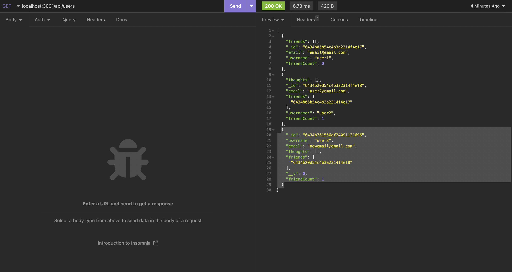

# Social Network API
## An API for a social network web application, which will be accessed through the command line and data can be viewed vis Insomnia

## Installation
+ Node.js must be installed to the user's device in order for this application to function (ensure Version 18 is in use when running)
+ The NPM packages for Express, Mongoose and Moment will ensure optimal run-time

## Usage

+ Link to Screencastify: https://drive.google.com/file/d/1jez5e0oiud-f7dktMVax8a_ajpOojulc/view
+ Link to Github Repo: https://github.com/priyanka-agrawal025/social-network-api

## Credits
+ There were no collaborators on this project

## Licenses
+ An MIT License was used for this project

## Badges
